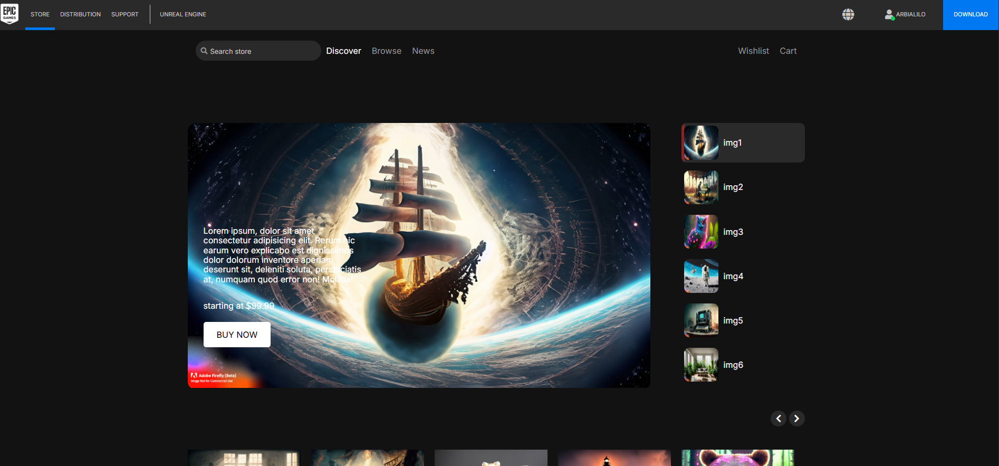
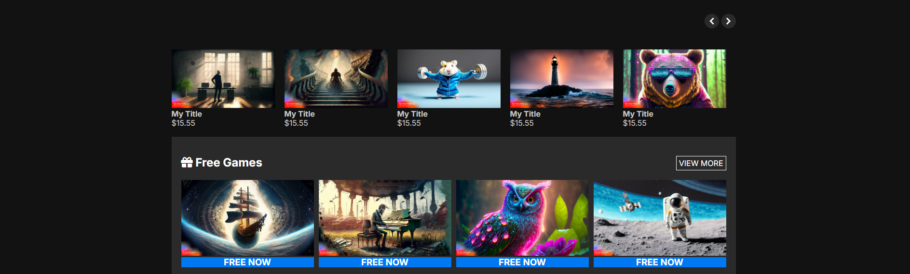

# Alilo Coding — Game Store Landing Page

> A sleek, dark-themed **Game Store** landing page inspired by the Epic Games Store, built with **HTML5**, **CSS3**, and **Vanilla JavaScript (ES6)**. Features a full-screen auto-rotating hero slider, a horizontally scrollable product gallery with prev/next navigation, a fully responsive mobile menu with animated hamburger, and nested slide-in dropdowns — all powered by custom JS with zero libraries.

---

## 📸 Preview


|---|---|
|  |  |

---

## ✨ Features

- **Dark Theme** — Deep charcoal palette (`#121212` / `#2a2a2a`) throughout every section
- **Auto-Rotating Hero Slider** — 6 images auto-advance every 10 seconds with a `translateX` CSS transition; thumbnail sidebar highlights the active slide with a live progress animation
- **Horizontal Scrollable Gallery** — 25 product cards scroll smoothly with `←` `→` buttons; buttons dim when reaching either end; scroll position corrects itself on window resize
- **Responsive Mobile Menu** — Full-screen slide-in nav (`translateX`) with an animated hamburger-to-X icon; locks `body` scroll when open
- **Nested Slide-In Dropdowns (Mobile)** — Profile and Language sub-menus slide in from the side on mobile, with a back-chevron to close
- **Language Selector** — Dropdown with Arabic and French options (desktop: CSS hover, mobile: JS slide)
- **User Profile Dropdown** — Shows username and links; green online-status dot on avatar via CSS `::after`
- **Sticky Dark Sub-Navbar** — Stays at top on scroll; search bar, Discover/Browse/News links, Wishlist and Cart icons; collapses to a "Discover" dropdown on mobile
- **Download CTA Button** — Blue `#0078f2` button in the header matching Epic's style
- **Free Games Section** — 4-column grid at the bottom with a "free now" badge
- **CSS Image Hover Overlay** — Subtle white flash on gallery card hover via `::before` pseudo-element
- **Custom CSS Utility Framework** (`framework.css`) — Hand-built utility class library (Flexbox, Grid, spacing, borders, typography, responsive helpers)
- **Self-Hosted Font Awesome 5** — Full icon pack, no CDN required
- **Inter Google Font** — Clean sans-serif typeface matching modern game store UIs

---

## 🎨 Color Palette

```css
:root {
  --main-color:        #121212;  /* Darkest — page & landing background    */
  --second-color:      #2a2a2a;  /* Dark grey — header, cards, sidebar      */
  --Third-color:       #0078f2;  /* Blue accent — active links, Download btn */
  --main-text-color:   #c7c7c7;  /* Grey — secondary labels and nav text    */
  --second-text-color: #ffffff;  /* White — primary headings and hero text  */
  --transition:        0.3s;     /* Global transition speed                 */
}
```

---

## 🗂️ Project Structure

```
tmplelet5/
│
├── index.html              # Single-page entry point
│
├── css/
│   ├── main.css            # Dark theme component styles
│   ├── framework.css       # Custom CSS utility framework
│   ├── all.min.css         # Font Awesome 5 (self-hosted)
│   └── normalize.css       # Cross-browser style reset
│
├── js/
│   └── main.js             # All interactivity (hamburger, slider, gallery, dropdowns)
│
├── img/
│   ├── logo.png            # Header logo
│   ├── img1.jpg – img25.jpg  # Game cover images (hero + gallery + free section)
│   ├── back.png            # Back navigation arrow
│   └── next.png            # Next navigation arrow
│
├── webfonts/               # Self-hosted Font Awesome 5 font files
│   ├── fa-solid-900.*      # (.eot, .svg, .ttf, .woff, .woff2)
│   ├── fa-brands-400.*
│   └── fa-regular-400.*
│
└── imageGithub/            # Preview screenshots for README
    └── 1.png, 2.png
```

---

## 📄 Sections Overview

| Section | Description |
|---|---|
| **Header** | Dark bar: logo, nav links (Store, Distribution, Support, Unreal Engine), language selector, user profile, Download button |
| **Sub-Navbar** | Sticky dark bar: search input, Discover / Browse / News links (collapses on mobile), Wishlist and Cart |
| **Landing / Hero** | Auto-rotating full-width carousel (6 images, 10s interval) with text + price overlay, Buy Now CTA, and clickable thumbnail sidebar |
| **Gallery** | Horizontal scrollable grid of 25 product cards with title + price, controlled by ← → chevron buttons |
| **Free Games** | 4-column grid of free games with a blue "free now" label |

---

## ⚙️ JavaScript Features (`main.js`)

All interactivity is written in **pure Vanilla JavaScript (ES6)** — no jQuery, no libraries:

| Feature | Implementation |
|---|---|
| **Hamburger menu** | `classList.toggle("open")` animates 3 spans into an ✕ icon; locks `body` scroll via `overflowY: hidden` |
| **Mobile full-screen menu** | CSS `translateX(100%)` → `translateX(0%)` triggered by `.open` class on toggle |
| **Profile & Language dropdowns** | `showAndClose()` helper slides sub-panels in/out from the right on mobile; on desktop, CSS `:hover` takes over |
| **Resize handler** | `window.addEventListener("resize")` removes all `.open` classes when viewport exceeds 767px |
| **Mobile nav sub-menu** | "Discover" button toggles `.open` on `.select`, revealing Discover/Browse/News via CSS `display: block` |
| **Auto-rotating hero slider** | `setInterval` every 10s; cycles `index`; applies `transform: translateX(0%)` to the target image; resets all others |
| **Active thumbnail progress** | The active `<li>` gets class `.active`, triggering a CSS `transition: 10s linear` overlay that fills from `width: 0%` to `width: 100%` |
| **Horizontal gallery scroll** | `nextBtn` / `backBtn` increment `scrollLeft` by the container's `offsetWidth`; `countScroll` tracks position (max 4 steps) |
| **Button opacity feedback** | Back/Next buttons set `opacity: 0.5` and `pointerEvents: none` at scroll boundaries |
| **Resize scroll correction** | `editScroll()` recalculates `scrollLeft` on window resize so the gallery stays snapped to the correct page |

---

## 📱 Responsive Behavior

| Viewport | Header | Sub-Navbar | Hero |
|---|---|---|---|
| `> 768px` | Full horizontal layout, CSS hover dropdowns | All links visible | Side-by-side images + thumbnails |
| `≤ 767px` | Hamburger button, full-screen slide-in menu, nested sub-panels | Icon-only (wishlist/cart), "Discover" dropdown | Stacked: hero full-width, thumbnails hidden |

---

## 🛠️ Built With

| Technology | Purpose |
|---|---|
| HTML5 | Semantic single-page structure |
| CSS3 + Custom Properties | Dark theme, transitions, responsive layout |
| Vanilla JavaScript (ES6) | Slider, gallery scroll, menus, dropdowns |
| `framework.css` | Hand-built utility class library |
| [Font Awesome 5](https://fontawesome.com/) | Self-hosted icons (.eot, .svg, .ttf, .woff, .woff2) |
| [Inter](https://fonts.google.com/specimen/Inter) | Google Font — clean modern typeface |
| [Normalize.css](https://necolas.github.io/normalize.css/) | Cross-browser style reset |

---

## 🚀 Getting Started

```bash
# Clone the repository
git clone https://github.com/your-username/tmplelet5.git
cd tmplelet5

# Open directly (no build step needed)
open index.html        # macOS
xdg-open index.html    # Linux
start index.html       # Windows
```

> **Tip:** Use **Live Server** (VS Code extension) for auto-refresh on save.

---

## 📝 Customization Guide

**Change the accent blue:**
```css
/* css/main.css */
:root {
  --Third-color: #your-color;  /* active links, Download button */
}
```

**Change the hero slide interval** (currently 10 seconds):
```js
// js/main.js
let counter = setInterval(() => { ... }, 10000); // change 10000 to ms you want
```

**Add a hero slide:**
1. Add an `.image` div inside `.landing .container .images`
2. Add a matching `<li>` inside `.landing .container ul`
3. Update the `overlay.length - 1` check in the `setInterval` callback

**Add a gallery card:**
```html
<div class="box">
  <div class="imag wid-full">
    
  </div>
  <h4>Game Title</h4>
  <span class="price">$29.99</span>
</div>
```

**Update the username:**
Find `<span class="userName t-tra-u">arbialilo</span>` in `index.html` and replace it with your username (appears in both the header and the mobile dropdown).

---

## 🌐 Browser Support

| Browser | Support |
|---|---|
| Chrome | ✅ Latest |
| Firefox | ✅ Latest |
| Safari | ✅ Latest |
| Edge | ✅ Latest |
| IE | ❌ Not supported (uses CSS Custom Properties & ES6) |

---

## 📜 License

This project is open-source and available under the [MIT License](LICENSE).

---

## 🙋 Author

**Alilo Alaedine**
- GitHub: [@yBoutefahaAlaeddine](https://github.com/BoutefahaAlaeddine)

---

> ⭐ If you found this template useful, consider giving it a star on GitHub!
